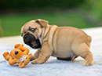

# Game Show


Congratulations, you've been selected to be a contestant on **jQuery Game Show**!!!!! The rules are pretty straight forward. All you have to do to win is write some jQuery selectors.

##Let's Get Started

### Step 1:

Click `N Open` at the top of this page to open the files in Nitrous so you can edit them.


### Step 2: 

Take a look at the files in this directory. You'll notice you have a `js` directory, an `index.html` file, and a `css` directory. All we care about for this lab is `index.html` and  `js/gameshow.js`.

### Step 3:

Open `index.html` in the browser by running in terminal: `python -m SimpleHTTPServer 3000`.

You should see this output in the terminal:


Then select `preview` and then `port 3000`.


You should see a page with three brown doors:


### Step 4:

Open up both `index.html` and `js/gameshow.js` in the Nitrous text editor. Your job is to fill in the jQuery selectors that make the doors turn around. If you get the selectors wrong, you won't get your prize! The selector for each door as to be filled in three separate times. Look for the comments in `js/gameshow.js` to figure out where to put the comments.

One last thing, the HTML for every door looks something like this:

```html
<div class="perspective" id="door1" >
  <div class="front1">
  </div>
  <div class="back">
    
  </div> 
</div>
```

The parent div for each door that contains `class="perspective"` is the main div for the door. Make sure your jQuery selectors select that div for each door, otherwise you won't get your prize!


